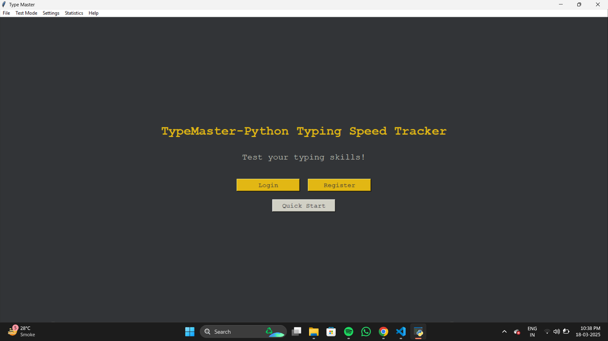
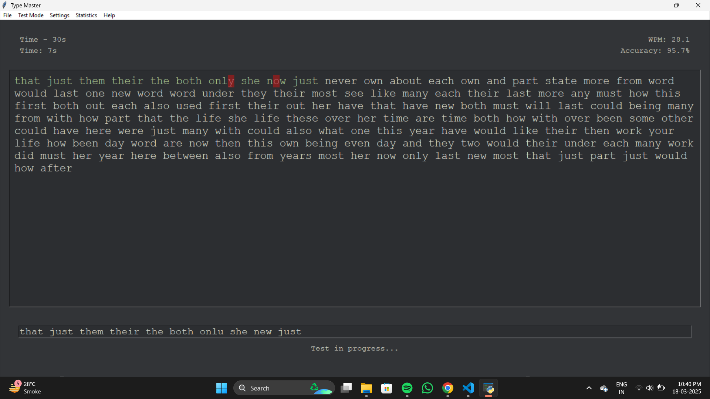
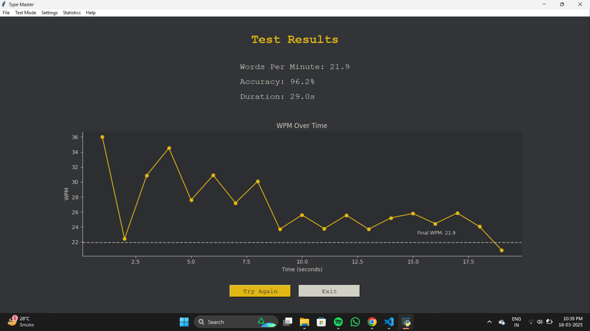

# 🎯 TypeMaster - Python Typing Speed Tracker

  
  
  

> **TypeMaster** is a sleek and powerful desktop application that helps you track and improve your typing speed and accuracy with multiple test modes, real-time feedback, user authentication, and beautiful statistics visualizations.

---

## 🚀 Features

 ⌨️ **Typing Test Modes**
  - Time-based: 15s, 30s, 60s, 120s
  - Word-based: 10, 25, 50, 100 words
  - Paragraph-based test
  - Custom text typing test

 👤 **User Authentication**
  - Register, Login, Logout
  - Secure password hashing (SHA-256)
  - User statistics (WPM, accuracy, test history)

 📊 **Statistics & Leaderboard**
  - WPM & Accuracy trend graphs
  - Track progress over time
  - Global leaderboard (Top performers)

 🎵 **Sound Effects**
  - Keypress, Error, Completion sounds
  - Toggle sound settings

 🎨 **Themes & Settings**
  - Light/Dark mode
  - Customizable font size

 💾 **Database Integration**
  - SQLite-powered
  - Persistent user and test data

---

## 📸 Screenshots

> 
> 
> 

---

## 🔧 Installation

### typemaster/

- │
- ├── main.py                   (Main application file)
- ├── typing_test.py            (Typing test logic and UI) 
- ├── database_manager.py       (Handles SQLite database operations)
- ├── user_auth.py              (Login, registration, authentication)
- ├── settings_manager.py       (Appearance and user settings)
- ├── stats_visualizer.py       (WPM/Accuracy graphs and stats)
- ├── sound_manager.py          (Sound effect manager uses pygame)
- └── sounds/                   (Folder to store MP3 sound effects)
